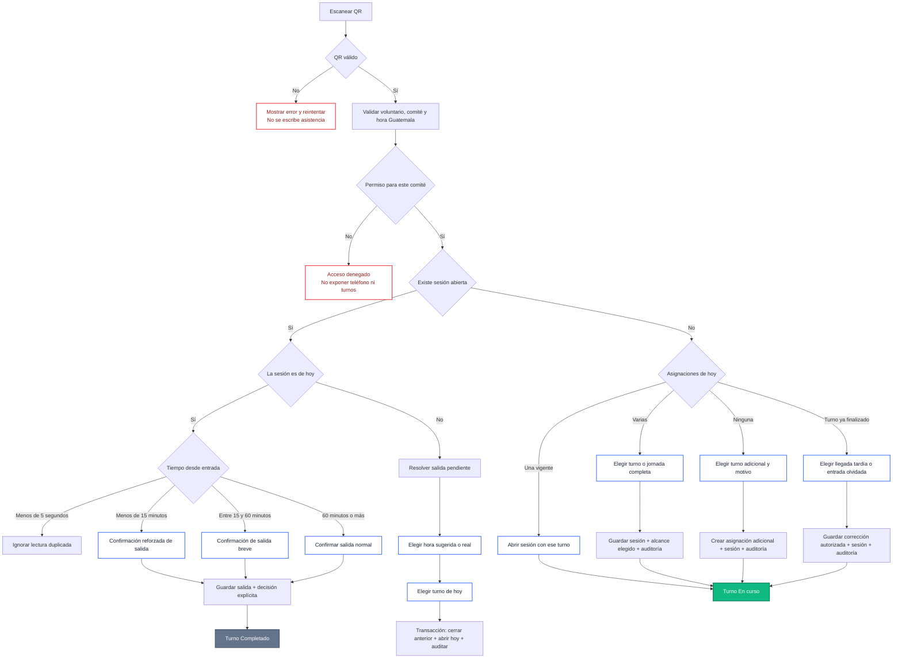
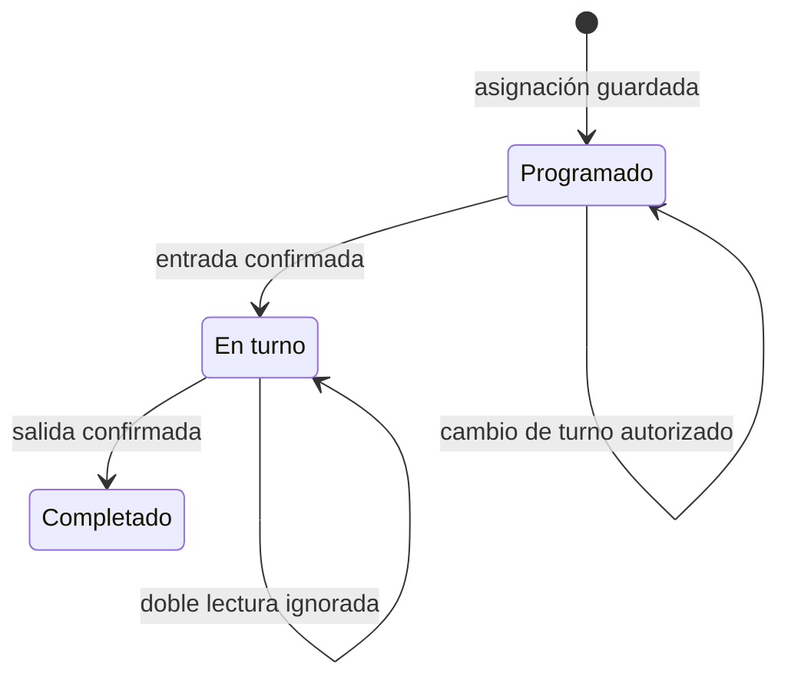
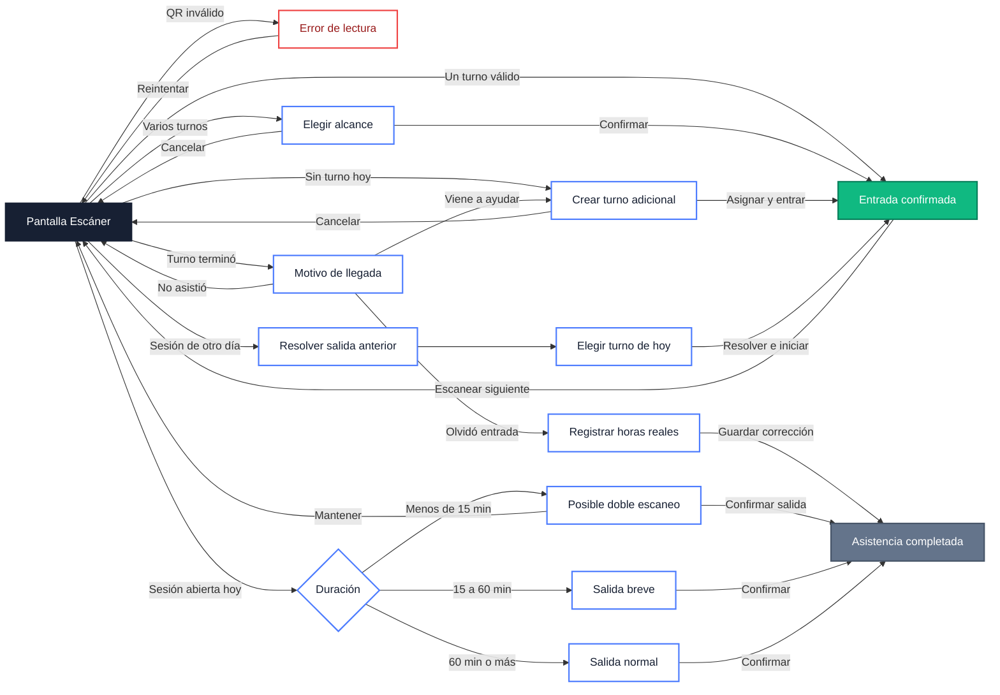

# Plan definitivo: asistencia sin turnos naranja

## 1. Resultado que debe garantizar el sistema

La sección **Turnos** no tendrá un estado naranja de asistencia.

- Un turno programado conserva su estado normal.
- Una entrada válida queda **En turno**.
- Una salida válida queda **Completada**.
- Una decisión excepcional tomada en el escáner queda guardada como parte de la asistencia y no genera una revisión posterior.
- Una corrección administrativa conserva la relación entre la sesión original, la sesión final, la explicación y la persona que la aplicó.
- Un error técnico que impida guardar no cambia la asistencia. Se resuelve en el escáner antes de intentar nuevamente.

Para el cierre histórico actual, la condición de aceptación es:

- **0 alertas anteriores al 17 de septiembre de 2026.**
- El 17 de septiembre puede mostrar únicamente incidencias creadas ese mismo día mientras se revisan.
- Ningún turno no asignado puede aparecer como visitado por el solapamiento horario de un turno vecino.

## 2. Principio central

El sistema dejará de deducir una decisión humana después del evento.

Cuando haya más de una interpretación posible, el escáner solicitará una decisión antes de escribir la sesión. La sesión y la decisión se guardarán en una sola transacción. Turnos consumirá esa decisión persistida y no volverá a reinterpretarla únicamente por el horario.



## 3. Estados visibles en Turnos

| Estado | Color | Significado |
| --- | --- | --- |
| Programado | Azul `#4d7cfe` | Tiene asignación y todavía no registra entrada |
| En turno | Verde esmeralda `#10b981` | Existe una sesión abierta válida |
| Completado | Gris/slate | Existe una sesión cerrada válida |

Estos estados provienen del helper visual usado por el cronograma. Un turno adicional conserva uno de los tres estados y añade el indicador `+`; **Adicional no es un cuarto estado**.

El estado `needs_review` y la bandera visual naranja dejarán de formar parte de las tarjetas de Turnos y del cronograma. Una anomalía de escritura no se convierte en estado del turno: la operación falla completa y el escáner conserva la pantalla de decisión para reintentar.



## 4. Flujo de cada decisión

### 4.1 QR inválido o voluntario inexistente

**Decisión:** reintentar el escaneo.

**Persistencia:** se puede registrar un evento técnico sin datos personales; no se crea ni modifica una sesión.

**Resultado en Turnos:** ningún cambio.

### 4.2 Voluntario archivado

**Decisión:** cerrar la tarjeta o abrir el perfil si el rol tiene permiso.

**Persistencia:** evento técnico con código `ARCHIVED`; no se crea sesión.

**Resultado en Turnos:** ningún cambio.

### 4.3 Un único turno válido

**Decisión:** no requiere intervención adicional.

**Persistencia atómica:** sesión abierta, turno elegido y evento de auditoría.

**Resultado en Turnos:** `En turno` en el turno elegido.

### 4.4 Varios turnos asignados

**Decisión obligatoria:**

- Turno específico.
- Jornada completa, únicamente si los turnos forman un bloque continuo.

La recomendación aparece preseleccionada, pero no se confirma mediante temporizador.

**Persistencia atómica:** sesión, lista de turnos elegidos, tipo de asistencia, coordinador y hora Guatemala.

**Resultado en Turnos:** la sesión solamente puede afectar los turnos elegidos. El tiempo trabajado sigue determinando si se completaron.

### 4.5 Sin turno asignado hoy

**Decisión obligatoria:** seleccionar un turno adicional y una razón breve.

**Validaciones:** permiso por comité, horario disponible, capacidad y ausencia de una asignación duplicada.

**Persistencia atómica:** asignación adicional, sesión, decisión y auditoría.

**Resultado en Turnos:** `En turno` como turno adicional legítimo.

### 4.6 El turno asignado ya terminó

El coordinador elige una de estas explicaciones:

1. **Está llegando ahora para ayudar:** se registra un turno adicional actual o próximo.
2. **Trabajó antes y olvidó escanear:** un rol autorizado registra las horas reales y el motivo.
3. **No asistió:** no se crea asistencia.

Ninguna opción crea una sesión corta artificial sobre un turno finalizado.

### 4.7 Segundo escaneo antes de cinco segundos

**Decisión:** ninguna. Se ignora como duplicado de cámara.

**Persistencia:** opcionalmente se incrementa un contador técnico; no se modifica la sesión.

### 4.8 Segundo escaneo antes de quince minutos

La acción principal es **Mantener en turno**.

Para cerrar, el coordinador debe marcar una confirmación explícita. La decisión `confirmed_short_exit` queda ligada a la sesión.

**Resultado en Turnos:** si confirma, `Completado`; si cancela, `En turno`. No se genera alerta posterior.

### 4.9 Salida entre quince y sesenta minutos

Se muestra la duración y se confirma la salida breve. La confirmación queda registrada.

**Resultado en Turnos:** `Completado`, sin alerta posterior.

### 4.10 Sesión abierta de un día anterior

La pantalla muestra:

- Día y hora de entrada anterior.
- Hora de salida sugerida según el bloque asignado.
- Opción para registrar la hora real.
- Motivo de la resolución.
- Turno que iniciará hoy.

Una sola transacción debe:

1. Verificar que la sesión anterior siga abierta.
2. Cerrarla con la decisión seleccionada.
3. Abrir la sesión de hoy con el turno elegido.
4. Guardar ambas decisiones y la auditoría.

Si falla cualquier paso, no se guarda ninguno.

### 4.11 Corrección administrativa posterior

Toda corrección debe guardar:

- Sesión original.
- Sesión final, si fue reemplazada o unida.
- Valores anteriores y nuevos.
- Motivo.
- Administrador.
- Fecha y hora.
- `hide_alert = true` como parte de la misma transacción.

El identificador original y el identificador final quedan reconocidos como resueltos.

## 5. Experiencia móvil

Las pantallas se diseñarán primero para anchos de 360 a 430 píxeles, con controles táctiles de al menos 44 píxeles y acciones principales fijas en la parte inferior.

### Mapa completo de pantallas



> En el diagrama, “Entrada confirmada” conduce al estado visual verde **En turno**. El azul se mantiene en los turnos que siguen **Programados**, y la salida cambia el turno a gris **Completado**.

### Pantalla base del escáner

```text
┌──────────────────────────────┐
│ Escanear asistencia      17  │
│──────────────────────────────│
│                              │
│       ÁREA DE CÁMARA         │
│       QR centrado            │
│                              │
│──────────────────────────────│
│ Último registro              │
│ Nombre · Comité              │
│ ● Verde · En turno           │
│ Turno T2 · Entrada 11:14     │
│                              │
│ [ Escanear siguiente ]       │
└──────────────────────────────┘
```

### Selección de varios turnos

```text
┌──────────────────────────────┐
│ Confirmar asistencia         │
│ Sofía Argueta                │
│ Acreditaciones · 11:14       │
│──────────────────────────────│
│ ● T2 · 11:00–15:00           │
│   Recomendado                │
│ ○ Jornada T1 + T2            │
│ ○ T1 · llegada tardía        │
│                              │
│ La selección quedará         │
│ registrada con tu usuario.   │
│──────────────────────────────│
│ [ Confirmar turno ]          │
│ [ Cancelar ]                 │
└──────────────────────────────┘
```

Al confirmar, el turno elegido pasa de azul **Programado** a verde **En turno**. Los demás turnos programados permanecen azules.

### Posible doble escaneo

```text
┌──────────────────────────────┐
│ Posible doble escaneo        │
│ Entrada hace 2 minutos       │
│──────────────────────────────│
│ Mario continúa con una       │
│ sesión activa en T2.         │
│                              │
│ [ Mantener en turno ]        │
│                              │
│ □ Confirmo que se retira     │
│ [ Registrar salida ]         │
└──────────────────────────────┘
```

`Mantener en turno` conserva el verde. `Registrar salida` cambia el turno a gris **Completado** y guarda la confirmación para que no aparezca una revisión posterior.

### Resolver sesión anterior

```text
┌──────────────────────────────┐
│ Resolver salida pendiente    │
│ Paso 1 de 2                  │
│──────────────────────────────│
│ Sesión: miércoles 16         │
│ Entrada: 14:03               │
│                              │
│ ● Salida sugerida 18:00      │
│ ○ Indicar hora real          │
│ Motivo: Salida olvidada      │
│──────────────────────────────│
│ [ Continuar ]                │
└──────────────────────────────┘

┌──────────────────────────────┐
│ Iniciar asistencia de hoy    │
│ Paso 2 de 2                  │
│──────────────────────────────│
│ ● T2 · 11:00–15:00           │
│ ○ T3 · 14:00–18:00           │
│──────────────────────────────│
│ [ Resolver e iniciar ]       │
│ [ Volver ]                   │
└──────────────────────────────┘
```

### Turno adicional

```text
┌──────────────────────────────┐
│ Sin turno programado hoy     │
│ Carlos Mendoza · Logística   │
│──────────────────────────────│
│ Viene a apoyar en:           │
│ [T1] [T2] [T3] [T4]          │
│                              │
│ Motivo                       │
│ [ Apoyo adicional________ ]  │
│──────────────────────────────│
│ [ Asignar y dar entrada ]    │
│ [ Cancelar ]                 │
└──────────────────────────────┘
```

El nuevo turno lleva el indicador `+` de adicional y queda verde **En turno**. Cuando registre salida quedará gris **Completado** conservando el indicador adicional.

## 6. Persistencia propuesta

### `attendance_session_decisions`

Una decisión por sesión, actualizable mediante historial auditado:

- `session_id`
- `volunteer_id`
- `day_key`
- `intended_shift_keys`
- `attendance_kind`: `scheduled`, `full_block`, `additional`, `late_entry`, `forgotten_scan`
- `exit_decision`: `normal`, `confirmed_short`, `resolved_stale`
- `reason_code`
- `explanation`
- `decided_by`
- `decided_at`
- `source`: `qr_scanner`, `manual_correction`, `historical_audit`

### `attendance_scan_events`

Registro inmutable de intentos para diagnosticar sin alterar Turnos:

- QR inválido.
- Lectura duplicada ignorada.
- Operación rechazada por permisos.
- Error de escritura.
- Acción completada y su identificador de transacción.

No se guardará teléfono, QR completo ni información sensible en estos eventos.

## 7. Acciones atómicas necesarias

1. `open_attendance_with_decision`
2. `assign_additional_shift_and_check_in`
3. `close_attendance_with_decision`
4. `resolve_stale_session_and_check_in`
5. `correct_attendance_and_resolve_review`

Todas deben incluir:

- Control de concurrencia.
- Clave de idempotencia por escaneo.
- Validación del voluntario y comité.
- Hora calculada en `America/Guatemala` por el servidor.
- Escritura de auditoría dentro de la misma transacción.
- Respuesta estructurada y tipada.

## 8. Fases de implementación

### Fase 0 — Cierre histórico

- Conservar las 68 resoluciones existentes.
- Verificar todas las pantallas: Turnos, perfil, calendario y revisión.
- Añadir una prueba que falle si aparece una alerta anterior al día actual de Guatemala.
- Forzar que una actualización de resoluciones refresque también sus identificadores en el contexto, no solamente las sesiones.

### Fase 1 — Modelo de decisiones

- Crear las tablas y restricciones.
- Migrar las 68 resoluciones como decisiones históricas, sin volver a modificar sus horas.
- Hacer que el cálculo de Turnos priorice `intended_shift_keys` sobre la inferencia horaria.

### Fase 2 — Operaciones transaccionales

- Implementar las cinco funciones atómicas.
- Aplicar permisos por comité en el servidor.
- Sustituir las secuencias actuales de dos o más llamadas.

### Fase 3 — Escáner móvil

- Implementar las hojas inferiores y pantallas anteriores.
- Eliminar el contador de confirmación automática.
- Reparar la creación real de un turno adicional.
- Mantener el escaneo rápido para el caso sencillo de un único turno.

### Fase 4 — Eliminar el estado naranja

- Retirar `needs_review` y `flag` de las tarjetas de Turnos.
- Retirar la opción naranja `Revisar` de la leyenda del cronograma.
- Mantener la paleta existente: azul Programado, verde En turno y gris Completado.
- Conservar los motivos y decisiones en el historial y auditoría.
- Mostrar errores técnicos dentro del escáner sin convertirlos en un estado del turno.

### Fase 5 — Verificación integral

- Datos reales: cero alertas antes del 17 de septiembre.
- Zona horaria: 23:59 y 00:01 de Guatemala.
- Doble lectura: 1, 4, 5, 14, 15 y 60 minutos.
- Todos los bloques simples, dobles y no continuos.
- Entrada tardía, turno adicional y entrada olvidada.
- Sesión pendiente del día anterior con éxito y rollback forzado.
- Permisos de administrador y coordinador de comité.
- Recarga completa, cierre y reapertura de la aplicación.
- Vista móvil a 360×640, 390×844 y 430×932, sin desplazamiento horizontal.

## 9. Criterio de terminación

La implementación estará terminada cuando:

1. La verificación global devuelva cero alertas históricas.
2. Turnos no contenga estilos ni estados naranja asociados a asistencia.
3. Cada excepción operativa pueda resolverse desde el teléfono antes de escribir datos ambiguos.
4. La decisión elegida sobreviva recargas y sea compartida por Turnos, perfil y calendario.
5. Ninguna acción permita leer o modificar un voluntario fuera del alcance de comité del usuario.
6. Una falla parcial deje la base de datos exactamente como estaba antes del intento.
